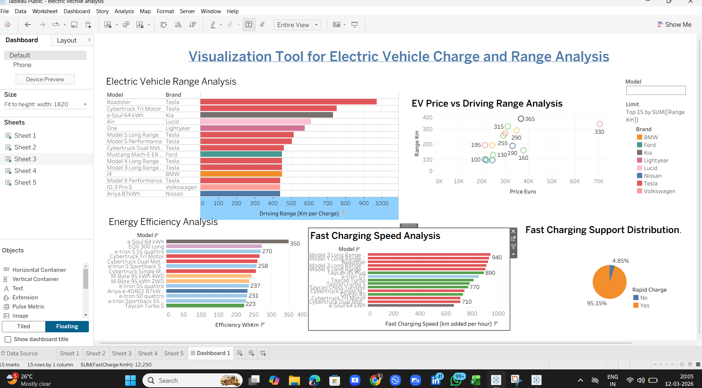

# ⚡ EV Charge & Range Analytics Dashboard

A **Tableau-based data visualization project** that analyzes electric vehicle charging performance, battery efficiency, and driving range.

This dashboard converts EV datasets into **interactive visual insights** to help understand vehicle performance, charging capabilities, and efficiency across different EV models.

---

# 📊 Dashboard Preview

  

---

# 🚀 Project Overview

Electric vehicles generate large amounts of data related to **battery systems, charging speed, and driving efficiency**.

This project builds an **interactive Tableau dashboard** to analyze:

- Driving range across EV models
- Relationship between EV price and driving range
- Fast charging speed comparison
- Energy efficiency of EVs
- Rapid charging support distribution

The goal is to support **data-driven insights in the EV ecosystem**.

---

# ✨ Key Features

## 🔋 Electric Vehicle Range Analysis
Compares EV models based on **driving range per charge** to identify vehicles with the longest range.

## 💰 EV Price vs Driving Range
A scatter plot visualizing the relationship between **vehicle price and driving range performance**.

## ⚡ Fast Charging Speed Analysis
Displays the **Top 15 EV models with the fastest charging speeds**.

## 🔌 Fast Charging Support Distribution
A pie chart showing the percentage of EV models that support **rapid charging technology**.

## ♻️ Energy Efficiency Analysis
Compares EV energy consumption using **Wh/km efficiency metrics**.

---

# 📈 Insights from the Dashboard

- Tesla models dominate the **highest driving range category**.
- Higher-priced EVs often provide **greater driving range**.
- Most modern EVs support **rapid charging capabilities**.
- Energy efficiency varies significantly between manufacturers.

---

# 🛠 Tech Stack

- **Tableau Public / Tableau Desktop**
- **Microsoft Excel**
- **GitHub**

---

# 📂 Project Structure
EV-Charge-Range-Analysis
│
├── README.md
├── dashboard.png
├── EV_Charge_Range_Analysis.twbx
└── Data analytics project.xlsx

---

# ▶ How to Run

1. Clone the repository

2. Open the **Tableau dashboard (.twbx)** file in Tableau Desktop or Tableau Public.

3. Explore the **interactive visualizations and filters**.

---

# 🔮 Future Improvements

- Integration of **real-time EV charging data**
- Machine learning model for **EV range prediction**
- Charging infrastructure analysis
- Web-based dashboard deployment

---

# 👩‍💻 Author

**Shruti Goel**  
MBA Student | Data Analytics Enthusiast
